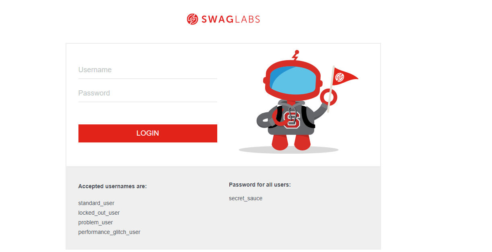

<h1> Automating a web application with selenium - Saucelabs project 🤖 ☕ </h1>

  <h2> Description: </h2>
  

    In this project, the selenium and junit frameworks were used. The project structure was organized in the Page Objects design pattern, with the actions and tests layer.
  

  

    We have 4 layers of tests that will run together:
    <ul>
      <li>Login and Checkout tests: Login validations, where multiple data will be entered through a parameterized test.</li>
      <li>Home page and Cart page tests: Tests of the functionality of elements such as: buttons, combo boxes, links.</li>
  </ul>
  

  <h2>Demonstration: </h2>
  ⚠️When running the tests, some pauses were used on the thread for better visualization.
  https://youtu.be/JVBYPQK0Ka0
 
  

  

